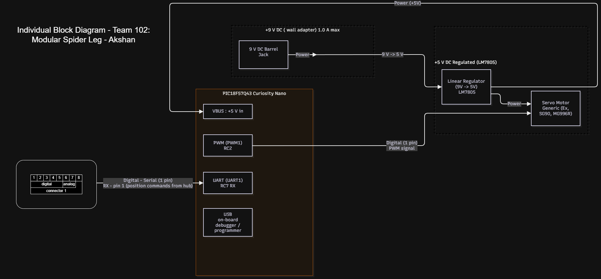

# Individual Block Diagram

## Overview
The purpose of this individual block diagram is to showcse the hardware architecture, electrical interfaces, and signal flow for the Servo Motor Subsystem of Team's Modular Spider Leg.

Key system parameters:
* **Power Source & Levels:** The board is powered by an external 9V DC wall adapter, which is stepped down via a linear regulator (LM7805) to a regulated 5V DC supply. This 5V domain powers the servo motor and the microcontroller.
* **Actuator & Sensors:** The primary actuator is a standard servo motor (e.g., TowerPro SG90) driven by a 5V PWM signal directly from the microcontroller.
* **Team Connections:** Operating as a "spoke" in our team's hub-and-spoke method, this board connects to the main hub board using the standard 8-pin ribbon connector.
* **Signal Flow:** The central hub sends digital position commands via a serial connection on Pin 1 to the PIC18F57Q43 microcontroller's UART RX pin. The microcontroller translates this command and outputs a digital parallel PWM signal to drive the servo motor to the target angle.

## Subsystem Block Diagram

**Figure:** Hardware block diagram detailing the power distribution and hub connections for the Servo Motor Subsystem.
